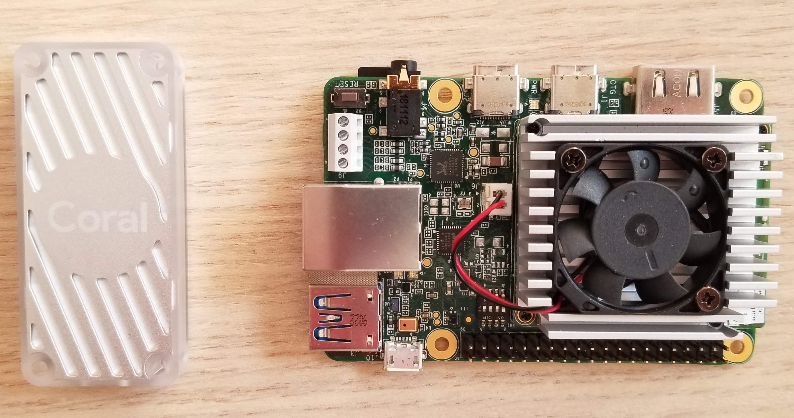
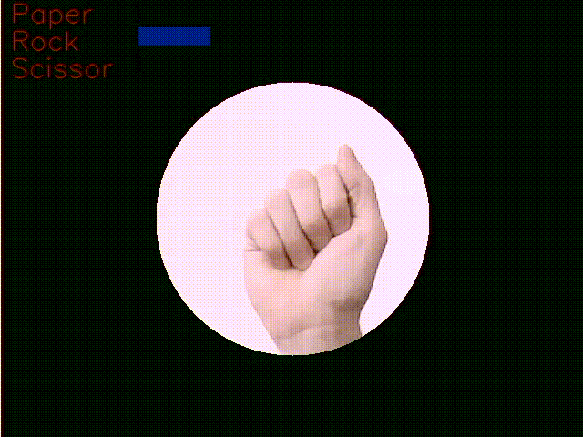

<h1 align="center"> ~ Rock - Paper - Scissor on Edge TPUs ~ </h1>

You know when you have some important stuff to do, but you try so hard to find excuses and other things to do to postpone everything? Today, 28/01/2020, it's one of those days :)) So, I really wanted to loose some time and explore a little bit these new edge AI devices made by [Google](https://coral.ai/) that are in my office.
In order to check their performance, I trained a very simple and dumb [CNN](https://github.com/EscVM/RPS_with_Edge_TPU/blob/master/media/baby_cnn_arch.png) (feel free to improve it) on the [Rock-Paper-Scissor](https://www.tensorflow.org/datasets/catalog/rock_paper_scissors) dataset and I made it run on a Coral Dev Board and a Raspberry 4 with the USB Coral Accelerator. These are my results:

<table align="center">
  <tr>
    <th><span style="font-weight:bold">Device</span></th>
    <th><span style="font-weight:bold">Inference Time [ms]</span></th>
    <th><span style="font-weight:bold">FPS</span></th>
  </tr>
  <tr>
    <td>Coral Dev Board</td>
    <td>1.3</td>
    <td>747</td>
  </tr>
  <tr>
    <td>Rasp 4 + USB Accelerator</td>
    <td>1.5</td>
    <td>689</td>
  </tr>
</table>




**Side Note** [fsalv](https://github.com/fsalv) will be or is (depending on when you are reading) a contributor of this repository. He wants to improve it and make it ukulele friendly.

# 1.0 Getting Started

Clone this repository

   ```bash
   git clone https://github.com/EscVM/RPS_with_Edge_TPU
   ```
Python3 is required. I used TensorFlow 2.x for the training, but I uploaded also all converted and original weights. So, if you don't want to re-train the network you can simply use the inference code.

## 1.1 Installations for the hosting device

Install on the hosting device to make the inference code work the following libraries:

- [opencv-python](https://pypi.org/project/opencv-python/)
- numpy
- [TensorFlow Lite Interpreter](https://www.tensorflow.org/lite/guide/python). If you're using the Coral USB Accelerator with the Raspberry 3 B+ or 4 download ARM32
**N.B.** If you are using the Dev Board the Interpreter and also the TFLite Converter are already installed


# 2.0 Run the Interpreter
Open your terminal in the project folder and launch:

   ```bash
   python3 rpc_webcame.py
   ```
   
Enjoy the network predicting the shape of your beautifull hands :)

<p align="center">
  
</p>

# 3.0 Improve the CNN Network 

As I already wrote in the introduction, I made this project very quickly to check the performance of my two Coral devices. So, I didn't spend time building a cool network. If you want to improve the CNN structure or using transfer learning to retrain your prefered architecture, in the project folder you can find the two jupyter notebook I used to **train** the network and **convert** from TensorFlow to TFLite. Then you have to use the [TPU compiler](https://coral.ai/docs/edgetpu/compiler/) to make your TFLite file TPU compatible. It's a long, but not difficult process. [Here](https://coral.ai/docs/edgetpu/models-intro/) you can find a beutifull summary of the entire chain.
